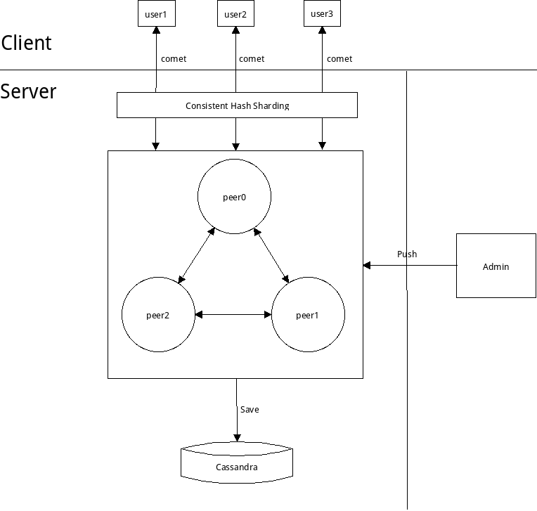

# xcomet

基于comet技术的高性能分布式消息推送服务器

## 架构



## 依赖

* cmake
* c++11(gcc 4.8 or above)
* zmq
* boost

### centos

```
sudo yum install cmake
sudo yum install boost-devel
(install zmq lib)
```

### ubuntu

```
sudo apt-get install cmake
sudo apt-get install libboost-dev
sudo apt-get install libzmq-dev
```

## 编译

** 默认编译类型为release **

```
./build.sh
BUILD_TYPE=release ./build.sh
BUILD_TYPE=debug ./build.sh
```

## 安装

```
./install.sh <install_path>
BUILD_TYPE=release ./install.sh <install_path>
BUILD_TYPE=debug ./install.sh <install_path>
```

## 运行

```
// 启动session server
./scripts/session_server.sh

// 停止session server
./scripts/session_server.sh stop

```

## 集群部署
```
// TODO
```


## 使用

### 客户端

客户端向session server发起http请求，请求完毕连接不关闭，服务器可以以chunk的方式持续推送消息
如果客户端使用tcp协议实现，那么客户端也可以随时向服务器发送消息
下面这个方法是普通的http客户端，所以只能单向的接受服务器推送的消息

```
curl http://session_server_host:9000/connect?uid=user001&password=pwd001
```

#### 连接协议

第一步，完成正常的tcp三次握手
第二步，发送一个类似下面这样的http头

```
GET /connect?uid=%s&password=%s HTTP/1.1\r\n
User-Agent: mobile_socket_client/0.1.0\r\n
Accept: */*\r\n
\r\n
```

第三部，检查http返回结果,主要检查http response code， 200表示成功，其他表示失败

连接成功

```
HTTP/1.1 200 OK\r\n
Connection: keep-alive\r\n
Content-Type: text/html; charset=utf-8\r\n
Transfer-Encoding: chunked\r\n
Date: Thu, 26 Mar 2015 07:08:43 GMT\r\n
\r\n
```

连接失败

```
HTTP/1.1 400 Bad Request\r\n
Content-Type: text/json; charset=utf-8\r\n
Date: Thu, 26 Mar 2015 07:10:46 GMT\r\n
Content-Length: 24\r\n
\r\n
{"error":"invalid uid"}
```

连接完成后就可以接着发送或者读取chunk消息了

#### 全双工chunk消息协议

chunk分两部分，第一部分是消息长度(16进制)加换行符，第二部分是消息内容

例如,下面是一个心跳包(发送和接收的格式一样，都是长度+消息内容)

```
a\r\n
{"y":0}\r\n
```

消息key

```
f 来源
t 目标
s 序列号
y 类型
u 用户(订阅和取消订阅时使用)
c 用户(订阅和取消订阅时以及频道消息时使用)
b 消息主体内容
```

消息类型

```
0 心跳
1 订阅
2 退订
3 普通消息
4 频道消息
5 ack
```

示例

```
// 订阅
{“y”: 1, "f": "user001", "c": "channel001"}

// 取消订阅
{“y”: 2, "f": "user001", "c": "channel001"}

// 发送到单人
{“y”: 3, "f": "user001", "t": "user002", "b": "this is a message body"}

// 发布到频道
{“y”: 4, "f": "user001", "c": "channel1", "b": "this is a message body"}

// 确认
{“y”: 5, "f": "user001", "s": 1}

// 心跳
{"y":0}
```

客户端接收到的消息

```
// 这是一个单人到单人的消息
{“y”: 3, "f": "user002", "t": "user001", "b": "this is a message body"， "s": 123}

// 这是一个频道消息
{“y”: 4, "f": "user002", "t": "user001", "c": "channel1", b": "this is a message body"， "s": 123}
```

### 管理员或后端服务

管理员向 session_server 请求向id为user001的用户push数据，该请求类型是 HTTP POST，推送的内容为POST body

```
// 单个用户推送
$ curl -d "@payload" "http://session_server_host:9001/pub?to=user001&from=op"
{
      "result": "ok"
}

// 频道信息发布
$ curl -d "@payload" "http://session_server_host:8100/pub?channel=channel1&from=op"
{
      "result": "ok"
}
```

订阅和取消订阅后端接口

```
$ curl http://session_server_host:9001/sub?uid=user001&cid=channel_id
$ curl http://session_server_host:9001/unsub?uid=user001&cid=channel_id
```

管理员查询服务器状态

```
$ curl "http://session_server_host:9001/stats"
{
   "result" : {
      "server_start_datetime" : "2015/03/23 18:19:44",
      "server_start_timestamp" : 13071579584867722,
      "throughput" : {
        "avg_recv_bytes_per_second" : 2129,
        "avg_recv_number_per_second" : 42,
        "avg_send_bytes_per_second" : 316620,
        "avg_send_number_per_second" : 416,
        "max_recv_bytes_per_second" : 12800,
        "max_recv_number_per_second" : 256,
        "max_send_bytes_per_second" : 7598894,
        "max_send_number_per_second" : 10000,
        "total_recv_bytes" : 51103,
        "total_recv_number" : 1024,
        "total_send_bytes" : 7598894,
        "total_send_number" : 10000
      },
      "user" : {
        "max_user_growth_per_second" : 1,
        "max_user_number" : 1,
        "max_user_reduce_per_second" : 0,
        "user_number" : 1
      }
   }
}
$ curl "http://session_server_host:9001/stats"
{
   "result" : {
      "server_start_datetime" : "2015/03/23 18:19:47",
      "server_start_timestamp" : 13071579587723487,
      "throughput" : {
        "avg_recv_bytes_per_second" : 2629,
        "avg_recv_number_per_second" : 48,
        "avg_send_bytes_per_second" : 361852,
        "avg_send_number_per_second" : 476,
        "max_recv_bytes_per_second" : 15552,
        "max_recv_number_per_second" : 288,
        "max_send_bytes_per_second" : 7598894,
        "max_send_number_per_second" : 10000,
        "total_recv_bytes" : 55224,
        "total_recv_number" : 1024,
        "total_send_bytes" : 7598894,
        "total_send_number" : 10000
      },
      "user" : {
        "max_user_growth_per_second" : 1,
        "max_user_number" : 1,
        "max_user_reduce_per_second" : 0,
        "user_number" : 1
      }
   }
}
```

管理员向 session_server 请求查询某用户的离线消息接口：

```
$ curl "http://session_server_host:9001/offmsg?uid=user78"
[
  "{\"b\":\"this is a channel message\",\"c\":\"channel1\",\"f\":\"webservice\",\"s\":1,\"t\":\"user78\",\"y\":4}\n",
  "{\"b\":\"this is a channel message\",\"c\":\"channel1\",\"f\":\"webservice\",\"s\":2,\"t\":\"user78\",\"y\":4}\n",
  "{\"b\":\"this is a channel message\",\"c\":\"channel1\",\"f\":\"webservice\",\"s\":3,\"t\":\"user78\",\"y\":4}\n",
  "{\"b\":\"this is a channel message\",\"c\":\"channel1\",\"f\":\"webservice\",\"s\":4,\"t\":\"user78\",\"y\":4}\n"
]
```

## 设计和实现

### 一致性哈希

通过一致性哈希算法进行分片
每个服务器只服务本节点的用户，同时担任其他节点的代理角色
频道消息通过一个cluter内部广播来实现

### 离线消息

无论用户是否在线，推送一条消息时给用户的同时进行持久化
每个用户的消息都有一个序列号seq，表示每个用户收到的消息条数
客户端收到消息后会回传一个ack, 并携带收到的消息序列号（不是每个包都会回传ack）
数据库还会对每个用户记录以下三个元信息，用来管理离线消息

* max_seq表示最大序列号
* min_seq表示离线消息中最小的序列号
* last_ack表示用户返回的确认序列号

服务器收到ack后即更新last_ack到存储层, 等服务器空闲的时候会删除min_seq与last_ack之间的所有消息
当用户登陆的时候，系统会取出last_ack到max_seq之间的所有消息(即用户未收到的离线消息）,发送给用户

### 频道(或群组)

当用户发送一个订阅的消息到服务器时，服务器立即将频道名与用户名的关系存到数据库
取消订阅时，将从数据库中删除频道与用户的关系数据
服务器第一次启动时，并不会加载所有的频道信息，只有第一次给频道发消息时，才会去请求数据库

## TODO

* 动态扩容
      (增加或删除服务器节点时，有部分用户需要重新分配服务节点, 也就是暂时无法动态扩容，需要重新配置和重启所有节点)
* 高可用
